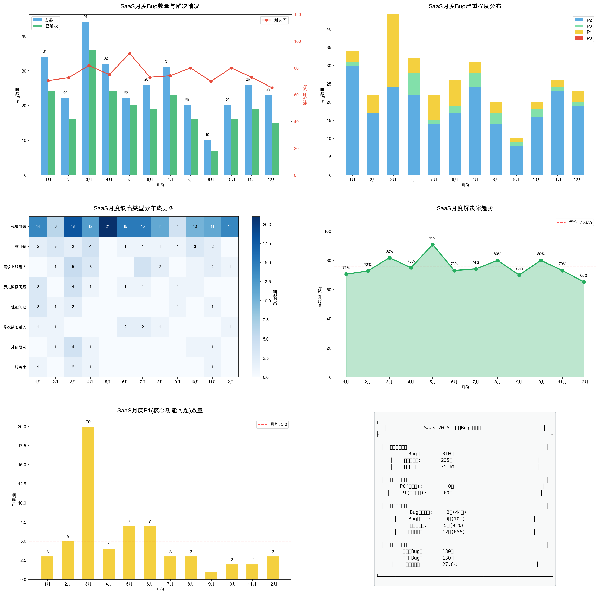

# 2025年度SaaS月度Bug分析报告

## 一、年度核心指标

| 指标 | 数值 |
|------|------|
| **年度Bug总数** | 310个 |
| **年度已解决** | 235个 |
| **年均解决率** | 75.6% |
| **P0(阻塞性)** | 0个 |
| **P1(核心功能)** | 60个 |

### 关键亮点
- ✅ **全年零P0问题**：SaaS产品稳定性表现优秀
- ✅ **下半年Bug下降27.8%**：上半年180个 → 下半年130个
- ✅ **9月Bug最少(10个)**：为全年最佳月份
- ⚠️ **代码问题占比69.3%**：需持续加强代码质量管控

---

## 二、月度数据汇总表

| 月份 | 总数 | 已解决 | 解决率 | P0 | P1 | P2 | P3 |
|------|------|--------|--------|----|----|----|----|
| 1月 | 34 | 24 | 70.6% | 0 | 3 | 30 | 1 |
| 2月 | 22 | 16 | 72.7% | 0 | 5 | 17 | 0 |
| **3月** | **44** | 36 | 81.8% | 0 | **20** | 24 | 0 |
| 4月 | 32 | 24 | 75.0% | 0 | 4 | 22 | 6 |
| **5月** | 22 | 20 | **90.9%** | 0 | 7 | 14 | 1 |
| 6月 | 26 | 19 | 73.1% | 0 | 7 | 17 | 2 |
| 7月 | 31 | 23 | 74.2% | 0 | 3 | 24 | 4 |
| 8月 | 20 | 16 | 80.0% | 0 | 3 | 14 | 3 |
| **9月** | **10** | 7 | 70.0% | 0 | 1 | 8 | 1 |
| 10月 | 20 | 16 | 80.0% | 0 | 2 | 16 | 2 |
| 11月 | 26 | 19 | 73.1% | 0 | 2 | 23 | 1 |
| 12月 | 23 | 15 | 65.2% | 0 | 3 | 19 | 1 |

---

## 三、季度对比分析

| 季度 | Bug数量 | 占比 | 解决情况 |
|------|---------|------|----------|
| **Q1(1-3月)** | 100 | 32.3% | 76个已解决 |
| **Q2(4-6月)** | 80 | 25.8% | 63个已解决 |
| **Q3(7-9月)** | 61 | 19.7% | 46个已解决 |
| **Q4(10-12月)** | 69 | 22.3% | 50个已解决 |

### 季度趋势分析
- Q1 Bug数量最高(100个)，主要受3月版本迭代影响
- Q3 Bug数量最低(61个)，质量管控效果显著
- **全年呈下降趋势**：Q1→Q3下降39%

---

## 四、月度详细分析

### 4.1 一月份
| 指标 | 数值 |
|------|------|
| 总数 | 34 |
| 已解决 | 24 |
| 解决率 | 70.6% |
| 严重程度 | P0=0, P1=3, P2=30, P3=1 |

**缺陷类型Top5**：
1. 代码问题: 14
2. 历史数据问题: 3
3. 性能问题: 3
4. 非问题: 2
5. 转需求: 1

---

### 4.2 二月份
| 指标 | 数值 |
|------|------|
| 总数 | 22 |
| 已解决 | 16 |
| 解决率 | 72.7% |
| 严重程度 | P0=0, P1=5, P2=17, P3=0 |

**缺陷类型Top5**：
1. 代码问题: 6
2. 非问题: 3
3. 需求上线引入: 1
4. 性能问题: 1
5. 修改缺陷引入: 1

---

### 4.3 三月份 ⚠️ 【Bug最多月份】
| 指标 | 数值 |
|------|------|
| 总数 | **44** |
| 已解决 | 36 |
| 解决率 | 81.8% |
| 严重程度 | P0=0, **P1=20**, P2=24, P3=0 |

**缺陷类型Top5**：
1. 代码问题: 18
2. 需求上线引入: 5
3. 历史数据问题: 4
4. 外部限制: 4
5. 非问题: 2

**分析**：3月P1问题达20个，为全年最高，与版本集中上线相关

---

### 4.4 四月份
| 指标 | 数值 |
|------|------|
| 总数 | 32 |
| 已解决 | 24 |
| 解决率 | 75.0% |
| 严重程度 | P0=0, P1=4, P2=22, P3=6 |

**缺陷类型Top5**：
1. 代码问题: 12
2. 非问题: 4
3. 需求上线引入: 3
4. 未复现问题: 2
5. 转需求: 1

---

### 4.5 五月份 ✅ 【解决率最高】
| 指标 | 数值 |
|------|------|
| 总数 | 22 |
| 已解决 | 20 |
| 解决率 | **90.9%** |
| 严重程度 | P0=0, P1=7, P2=14, P3=1 |

**缺陷类型**：
- 代码问题: 21 (几乎全部)

**分析**：5月解决率最高，Bug处理效率最佳

---

### 4.6 六月份
| 指标 | 数值 |
|------|------|
| 总数 | 26 |
| 已解决 | 19 |
| 解决率 | 73.1% |
| 严重程度 | P0=0, P1=7, P2=17, P3=2 |

**缺陷类型Top5**：
1. 代码问题: 15
2. 修改缺陷引入: 2
3. 历史数据问题: 1
4. 非问题: 1

---

### 4.7 七月份
| 指标 | 数值 |
|------|------|
| 总数 | 31 |
| 已解决 | 23 |
| 解决率 | 74.2% |
| 严重程度 | P0=0, P1=3, P2=24, P3=4 |

**缺陷类型Top5**：
1. 代码问题: 15
2. 需求上线引入: 4
3. 修改缺陷引入: 2
4. 非问题: 1
5. 历史数据问题: 1

---

### 4.8 八月份
| 指标 | 数值 |
|------|------|
| 总数 | 20 |
| 已解决 | 16 |
| 解决率 | 80.0% |
| 严重程度 | P0=0, P1=3, P2=14, P3=3 |

**缺陷类型Top5**：
1. 代码问题: 11
2. 需求上线引入: 2
3. 修改缺陷引入: 1
4. 非问题: 1
5. 重复问题: 1

---

### 4.9 九月份 ✅ 【Bug最少月份】
| 指标 | 数值 |
|------|------|
| 总数 | **10** |
| 已解决 | 7 |
| 解决率 | 70.0% |
| 严重程度 | P0=0, P1=1, P2=8, P3=1 |

**缺陷类型Top5**：
1. 代码问题: 4
2. 非问题: 1
3. 历史数据问题: 1
4. 重复问题: 1
5. 性能问题: 1

**分析**：9月Bug数量最少，产品质量最稳定

---

### 4.10 十月份
| 指标 | 数值 |
|------|------|
| 总数 | 20 |
| 已解决 | 16 |
| 解决率 | 80.0% |
| 严重程度 | P0=0, P1=2, P2=16, P3=2 |

**缺陷类型Top5**：
1. 代码问题: 10
2. 非问题: 3
3. 历史数据问题: 1
4. 需求上线引入: 1
5. 外部限制: 1

---

### 4.11 十一月份
| 指标 | 数值 |
|------|------|
| 总数 | 26 |
| 已解决 | 19 |
| 解决率 | 73.1% |
| 严重程度 | P0=0, P1=2, P2=23, P3=1 |

**缺陷类型Top5**：
1. 代码问题: 11
2. 需求上线引入: 2
3. 非问题: 2
4. 外部限制: 1
5. 转需求: 1

---

### 4.12 十二月份 ⚠️ 【解决率最低】
| 指标 | 数值 |
|------|------|
| 总数 | 23 |
| 已解决 | 15 |
| 解决率 | **65.2%** |
| 严重程度 | P0=0, P1=3, P2=19, P3=1 |

**缺陷类型Top5**：
1. 代码问题: 14
2. 需求上线引入: 1
3. 修改缺陷引入: 1
4. 配置问题: 1

**分析**：12月解决率最低，部分Bug跨年处理

---

## 五、缺陷类型年度分析

| 排名 | 缺陷类型 | 数量 | 占比 |
|------|----------|------|------|
| 1 | **代码问题** | 151 | 69.3% |
| 2 | 非问题 | 20 | 9.2% |
| 3 | 需求上线引入 | 19 | 8.7% |
| 4 | 历史数据问题 | 12 | 5.5% |
| 5 | 修改缺陷引入 | 8 | 3.7% |
| 6 | 性能问题 | 8 | 3.7% |

### 问题根因分析
1. **代码问题占比过高(69.3%)**：需加强Code Review和单元测试
2. **需求上线引入(8.7%)**：需完善上线前测试流程
3. **修改缺陷引入(3.7%)**：需加强回归测试

---

## 六、P1核心问题月度分布

| 月份 | P1数量 | 趋势 |
|------|--------|------|
| 1月 | 3 | - |
| 2月 | 5 | ↑ |
| **3月** | **20** | ↑ 峰值 |
| 4月 | 4 | ↓ |
| 5月 | 7 | ↑ |
| 6月 | 7 | → |
| 7月 | 3 | ↓ |
| 8月 | 3 | → |
| 9月 | 1 | ↓ |
| 10月 | 2 | ↑ |
| 11月 | 2 | → |
| 12月 | 3 | ↑ |

**P1月均**：5.0个
**P1趋势**：整体呈下降趋势，3月峰值后逐步收敛

---

## 七、关键结论与改进建议

### 7.1 年度成果
1. ✅ **全年零P0阻塞性问题**：产品核心功能稳定
2. ✅ **下半年质量提升明显**：Bug数量下降27.8%
3. ✅ **9月表现最佳**：仅10个Bug，质量管控效果显著

### 7.2 待改进项
1. ⚠️ **代码问题占比过高**：69.3%，建议：
   - 加强Code Review流程
   - 提高单元测试覆盖率
   - 引入静态代码分析工具

2. ⚠️ **12月解决率偏低**：65.2%，建议：
   - 年底前清理Bug积压
   - 避免Bug跨年

3. ⚠️ **3月P1问题集中**：20个，建议：
   - 控制版本上线节奏
   - 加强上线前测试

### 7.3 2026年目标建议
- Bug数量控制在250个以内（同比下降20%）
- 月均解决率提升至80%+
- 代码问题占比降至50%以下
- P1问题月均控制在3个以内

---

## 八、数据可视化

### 图表1：月度趋势与缺陷分析

### 图表2：季度对比与类型分布

---

**报告生成时间**：2026年1月30日  
**数据来源**：Jira项目管理系统导出数据
