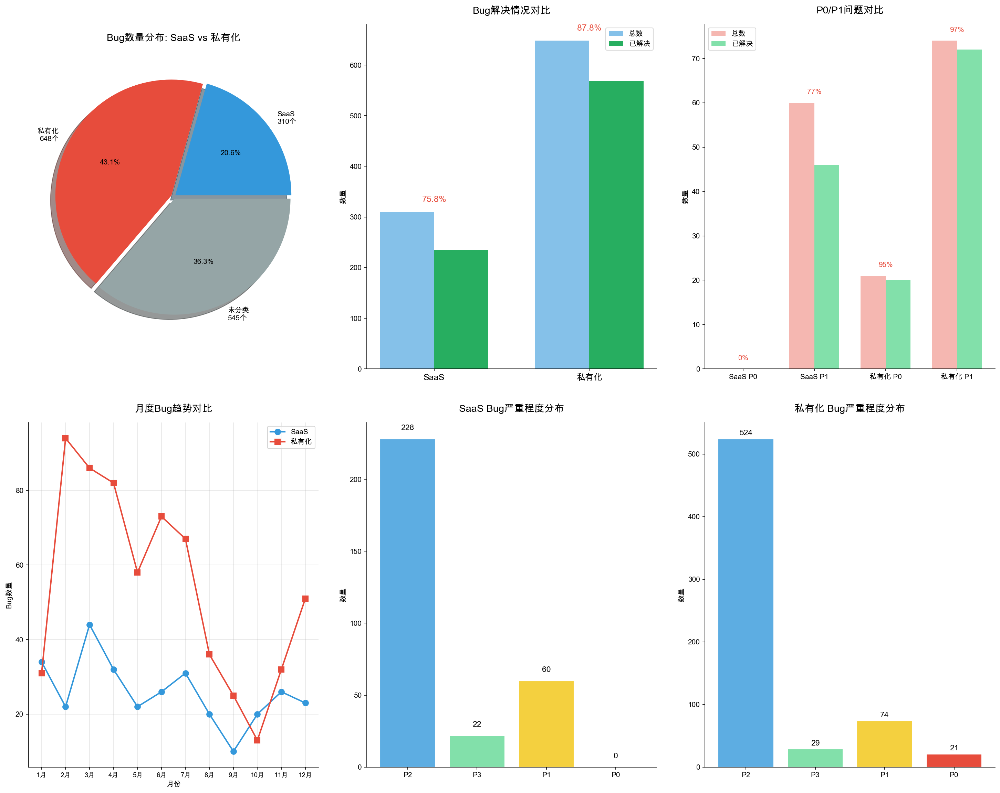

# 2025年度Bug分析报告 - SaaS与私有化对比

## 一、数据分类概况

| 部署类型 | Bug数量 | 占比 |
|----------|---------|------|
| **私有化** | 648 | 43.1% |
| **SaaS** | 310 | 20.6% |
| 未分类 | 545 | 36.3% |
| **总计** | 1503 | 100% |

---

## 二、核心指标对比

| 指标 | SaaS | 私有化 | 差异分析 |
|------|------|--------|----------|
| **Bug总数** | 310 | 648 | 私有化是SaaS的2.1倍 |
| **已解决** | 235 | 569 | - |
| **解决率** | **75.8%** | **87.8%** | 私有化高12% |
| **P0总数** | 0 | 21 | 所有P0均来自私有化 |
| **P0解决率** | - | **95.2%** | 处理高效 |
| **P1总数** | 60 | 74 | - |
| **P1解决率** | **76.7%** | **97.3%** | 私有化高20.6% |

### 关键发现
- ✅ **私有化解决率更高**：87.8% vs 75.8%，体现对大客户的重视
- ✅ **私有化P1解决率达97.3%**：几乎所有核心问题都得到解决
- ⚠️ **所有P0阻塞性问题均来自私有化客户**：21个P0全部在私有化环境
- ⚠️ **SaaS Bug积压较多**：解决率仅75.8%，需加强

---

## 三、SaaS Bug详细分析

### 3.1 状态分布
| 状态 | 数量 | 占比 |
|------|------|------|
| 完成 | 235 | 75.8% |
| 待办 | 49 | 15.8% |
| 挂起中 | 20 | 6.5% |
| 其他 | 6 | 1.9% |

### 3.2 严重程度分布
| 严重程度 | 数量 | 占比 |
|----------|------|------|
| P2（非核心功能问题） | 228 | 73.5% |
| P1（核心功能问题） | 60 | 19.4% |
| P3（不影响功能使用） | 22 | 7.1% |
| P0（阻塞性问题） | **0** | 0% |

**亮点**：SaaS环境无P0阻塞性问题，产品整体稳定性良好

### 3.3 缺陷类型Top10
| 排名 | 缺陷类型 | 数量 | 说明 |
|------|----------|------|------|
| 1 | **代码问题** | 151 | 占比48.7%，需重点关注 |
| 2 | 非问题 | 20 | 误报 |
| 3 | 需求上线引入 | 19 | 上线质量把控 |
| 4 | 历史数据问题 | 12 | - |
| 5 | 性能问题 | 8 | - |
| 6 | 修改缺陷引入 | 8 | - |
| 7 | 外部限制 | 8 | - |
| 8 | 转需求 | 5 | - |
| 9 | 重复问题 | 4 | - |
| 10 | 未复现问题 | 3 | - |

### 3.4 月度趋势
| 月份 | Bug数 | 趋势 |
|------|-------|------|
| 1月 | 34 | - |
| 2月 | 22 | ↓ |
| 3月 | 44 | ↑ 全年最高 |
| 4月 | 32 | ↓ |
| 5月 | 22 | ↓ |
| 6月 | 26 | ↑ |
| 7月 | 31 | ↑ |
| 8月 | 20 | ↓ |
| 9月 | **10** | ↓ 全年最低 |
| 10月 | 20 | ↑ |
| 11月 | 26 | ↑ |
| 12月 | 23 | ↓ |

**SaaS特点**：全年Bug数量相对平稳，波动不大（10-44区间）

---

## 四、私有化Bug详细分析

### 4.1 状态分布
| 状态 | 数量 | 占比 |
|------|------|------|
| 完成 | 569 | 87.8% |
| 处理中 | 30 | 4.6% |
| 待办 | 29 | 4.5% |
| 挂起中 | 16 | 2.5% |
| 其他 | 4 | 0.6% |

### 4.2 严重程度分布
| 严重程度 | 数量 | 占比 |
|----------|------|------|
| P2（非核心功能问题） | 524 | 80.9% |
| P1（核心功能问题） | 74 | 11.4% |
| P3（不影响功能使用） | 29 | 4.5% |
| **P0（阻塞性问题）** | **21** | **3.2%** |

### 4.3 缺陷类型Top10
| 排名 | 缺陷类型 | 数量 | 说明 |
|------|----------|------|------|
| 1 | **代码问题** | 164 | 占比25.3% |
| 2 | **非问题** | 88 | 占比13.6%，需优化 |
| 3 | **性能问题** | 63 | 占比9.7%，重点关注 |
| 4 | **客户操作问题** | 58 | 占比9.0%，需加强培训 |
| 5 | 配置问题 | 46 | 环境配置相关 |
| 6 | 外部限制 | 28 | 客户环境限制 |
| 7 | 重复问题 | 26 | - |
| 8 | **中间件问题** | 24 | 基础设施稳定性 |
| 9 | 历史数据问题 | 17 | - |
| 10 | 技术方案优化 | 16 | - |

**私有化特点**：
- 非问题占比高(13.6%)：说明需求沟通和问题定义需要加强
- 性能问题突出(9.7%)：私有化环境资源有限，需优化
- 客户操作问题多(9.0%)：需加强用户培训和文档

### 4.4 私有化客户Bug分布Top15
| 排名 | 客户 | Bug数量 | 客户类型 |
|------|------|---------|----------|
| 1 | **作业帮SDK** | 51 | SDK |
| 2 | **OPPO** | 49 | 私有化 |
| 3 | **广东电信研究院** | 47 | 私有化 |
| 4 | **唯品会** | 43 | 私有化 |
| 5 | **好未来** | 43 | 私有化 |
| 6 | **招商金科** | 39 | 私有化 |
| 7 | **新华三** | 32 | 私有化 |
| 8 | 跨越速运SDK | 30 | SDK |
| 9 | TCL SDK | 26 | SDK |
| 10 | 百度SDK | 18 | SDK |
| 11 | 小红书SDK | 18 | SDK |
| 12 | 格力SDK | 17 | SDK |
| 13 | 猿辅导 | 16 | 私有化 |
| 14 | 福田 | 15 | 私有化 |
| 15 | 滴滴SDK | 15 | SDK |

### 4.5 私有化P0问题客户分布
| 客户 | P0数量 | 占比 |
|------|--------|------|
| **福田** | 4 | 19.0% |
| **南方电网** | 4 | 19.0% |
| 招商基金 | 2 | 9.5% |
| 玉溪矿业 | 2 | 9.5% |
| 小红书SDK | 2 | 9.5% |
| 360数科 | 2 | 9.5% |
| 其他(5家各1个) | 5 | 23.8% |

**P0重点客户**：福田、南方电网是P0高发客户，各占19%

### 4.6 月度趋势
| 月份 | Bug数 | 趋势 | 说明 |
|------|-------|------|------|
| 1月 | 31 | - | - |
| 2月 | **94** | ↑ | 全年最高 |
| 3月 | 86 | ↓ | - |
| 4月 | 82 | ↓ | - |
| 5月 | 58 | ↓ | - |
| 6月 | 73 | ↑ | - |
| 7月 | 67 | ↓ | - |
| 8月 | 36 | ↓ | - |
| 9月 | 25 | ↓ | - |
| 10月 | **13** | ↓ | 全年最低 |
| 11月 | 32 | ↑ | - |
| 12月 | 51 | ↑ | - |

**私有化趋势特点**：
- Q1(1-3月)Bug集中爆发，2月达94个峰值
- 下半年持续改善，10月仅13个为全年最低
- 全年呈**明显下降趋势**，体现质量管控成效

---

## 五、季度对比分析

| 季度 | SaaS | 私有化 | 合计 | 私有化占比 |
|------|------|--------|------|-----------|
| Q1 | 100 | 211 | 311 | 67.8% |
| Q2 | 80 | 213 | 293 | 72.7% |
| Q3 | 61 | 128 | 189 | 67.7% |
| Q4 | 69 | 96 | 165 | 58.2% |

**季度趋势**：
- Q1-Q2私有化Bug占比高，超过2/3
- Q3-Q4私有化占比下降，SaaS占比相对上升
- Q4私有化Bug数量大幅下降（96个），仅为Q1的45%

---

## 六、对比结论与建议

### 6.1 核心结论

| 维度 | SaaS | 私有化 |
|------|------|--------|
| Bug数量 | 较少(310个) | 较多(648个) |
| 解决率 | 75.8% | **87.8%** ✅ |
| P0问题 | **0个** ✅ | 21个 |
| P1解决率 | 76.7% | **97.3%** ✅ |
| 主要问题 | 代码问题(48.7%) | 代码问题+非问题+性能 |
| 趋势 | 平稳 | 明显改善 |

### 6.2 SaaS改进建议
1. **提升解决率**：当前75.8%，建议提升至85%+
2. **加强代码质量**：代码问题占比48.7%，需强化Code Review
3. **减少需求上线引入**：完善上线检查流程

### 6.3 私有化改进建议
1. **降低非问题占比**：当前13.6%，需加强需求沟通
2. **优化性能**：性能问题占9.7%，需针对资源受限环境优化
3. **加强客户培训**：客户操作问题占9%，需完善操作手册
4. **重点关注P0高发客户**：福田、南方电网需建立专项保障机制
5. **加强中间件稳定性**：中间件问题24个，需优化部署方案

### 6.4 重点关注客户
| 类型 | 客户 | 建议措施 |
|------|------|----------|
| P0高发 | 福田、南方电网 | 建立专项保障、定期巡检 |
| Bug数量Top | 作业帮SDK、OPPO、广东电信 | 加强交付质量、定期复盘 |
| SDK客户 | 作业帮、跨越速运、TCL等 | 完善SDK文档、优化集成方案 |

---

## 七、数据可视化图表

### 图表1：核心对比概览

### 图表2：详细分析图表

---

**报告生成时间**：2026年1月30日  
**数据来源**：Jira项目管理系统导出数据
